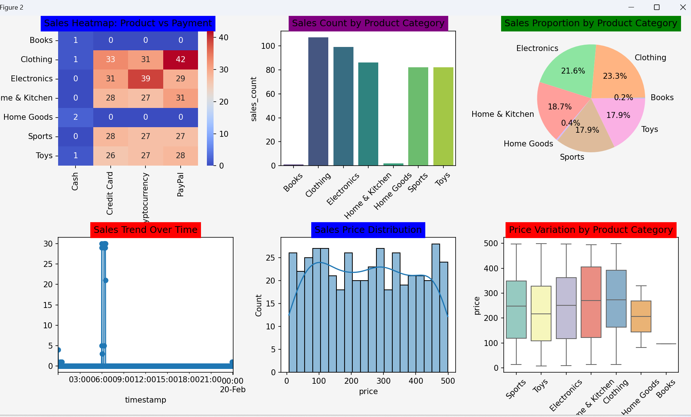

## buzzline-06-Priyanka
 📌 Kafka-Based Streaming Data Project

📈 **Author:** Priyanka Naskar 
📅 **Date:** February 18, 2025  
## Git- https://github.com/Priyankanaskar/buzzline-06-priyanka

##  Real-time Sales Analytics with Python & SQLite

## 🌟 Repository Overview
This project is a real-time data streaming system leveraging Apache Kafka. It includes:

🛒 E-commerce Data Streaming: Integrating live sales data.

📊 Real-Time Visualization: Displaying multiple data charts dynamically.

💾 Database Storage: Using SQLITE for persistence.

## 🚀 Features

📉 E-commerce Sales Monitoring: Tracking live sales data.

🔥 Kafka Producer & Consumer: Efficient streaming of data.

🗄 Database Support: Compatible with MongoDB & PostgreSQL.

📈 Interactive Charts: Live visual updates directly in the consumer script.

## 🚀 **Project Setup**

### 🔧 Installation

## Prerequisites 

Ensure you have the following installed:

⚙️ WSL (Windows Subsystem for Linux)

🏗 Apache Kafka

🐍 Python 3.x

🛢 MongoDB or PostgreSQL Or SQLITE extension

## Steps to Install Kafka on WSL

## Update and install dependencies: 

sudo apt update && sudo apt install openjdk-11-jdk wget

Download and extract Kafka:

wget https://downloads.apache.org/kafka/3.2.0/kafka_2.13-3.2.0.tgz

tar -xvzf kafka_2.13-3.2.0.tgz

## As Needed: Activate .venv and Install Packages

Run the following commands to activate our local project virtual environment and install the necessary packages. Wait for each command to finish before running the next command.

## One-time Only: Create it

Use the built-in venv utility to create a local project virtual environment in a folder named .venv.

Windows:
```
py -3.11 -m venv .venv
```
Mac/Linux:
```
python3 -3.11 -m venv .venv
```
## Activate and Install Dependencies

Windows:
```
.venv\Scripts\activate
py -m pip install --upgrade pip setuptools wheel
py -m pip install --upgrade -r requirements.txt
pip install -r requirements.txt
```
Mac/Linux:
```
source .venv/bin/activate
python3 -m pip install --upgrade pip setuptools wheel
python3 -m pip install --upgrade -r requirements.txt
```
Be patient. The process will end and a new .venv folder will appear. This folder will become very large - we don't do anything with it directly, but Python will use this local virtual environment folder to hold a lot of free code that we will use in our project. When done, .venv may be large. Allow time.

Activate Every Time We Open a New Terminal

Remember to always activate the .venv when opening a new terminal.

## ▶️ Running the Project
## Start Kafka Producer:
```
py -m kafka_producer.py
```
## Start Kafka Consumer with Charts:
```
python kafka_consumer.py
```

This script:
- Generates a **new sales transaction every 20 seconds**.
- Stores transactions in the **sales_data.sqlite** database.

## 📊 Real-Time Visualizations

This project generates six interactive real-time charts:

🔥 Heat Map: Sales Heat Map - Displays product vs. payment analysis.

📊 Bar Chart: Sales Count by Product Category - Represents product sales distribution.

🥧 Pie Chart: Product Sales by Category - Shows category-wise product sales.

📈 Line Chart: Sales Over Time - Tracks sales trends over time.

📊 Bar Chart with Line Overlay: Sales Over Time - Combines bar and line visualization for trends.

📉 Area Chart: Price Variation by Product Category - Displays how prices change across categories.

## 🛠 Future Enhancements

🔐 Implement authentication for email APIs.

⚡ Optimize database queries for faster processing.

🎨 Enhance chart visualizations with more styles and filters.

## 🤝 Contributing

Contributions are welcome! Feel free to fork the repo and submit a pull request.

## 📜 License

This project is licensed under the MIT License.

## 📷 Screenshots: 
